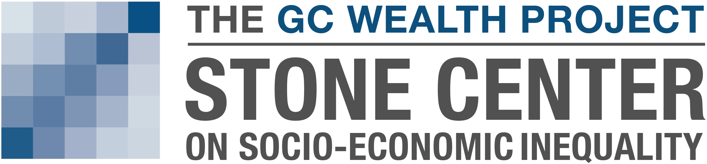

# The GC Wealth Project

<table align="center" width="80%">
  <tr>
    <td align="center" width="33.33%">
      
    </td>
    <td align="center" width="33.33%">
      
    </td>
    <td align="center" width="33.33%">
      
    </td>
  </tr>
</table>

## Introduction
The GC Wealth Project, a central project of the Graduate Center's [Stone Center on Socio-Economic Inequality](https://stonecenter.gc.cuny.edu), is a multi-year effort aimed at expanding and consolidating access to the most up-to-date research and information on wealth, wealth inequalities, and wealth transfers and related tax policies, across countries and over time.

The [GC Wealth Project website](https://wealthproject.gc.cuny.edu/index.html) — first launched in June 2023 — is organized around two main components: a data warehouse of gathered and novel data that can be visualized in a variety of ways through the interactive dashboard, and a Digital Library of Research on Wealth Inequality. Both are designed to provide researchers, policymakers, journalists, and others interested in wealth and wealth taxation with open, unlimited access to an array of high-quality information and resources.

## Datasets Overview (v1.0)

### Full Data Warehouse
For a comprehensive view, access our bulk download that consolidates all our datasets:
- **Download Warehouse with metadata** [Excel](https://docs.google.com/spreadsheets/d/1W5QPAtFphR2n37wzkkqv5ZMuyIZxa-ZA/edit?usp=share_link&ouid=114609468696885316335&rtpof=true&sd=true), [Stata](https://drive.google.com/file/d/1l82VBIsFXiY83UBvklZx8ozZngrGVLiK/view?usp=share_link), [CSV](https://drive.google.com/file/d/1FmO8qVbBshI0iQqyY321jjp1jfKnvLT_/view?usp=share_link)
- **Download Warehouse without metadata** [Excel](https://docs.google.com/spreadsheets/d/1gXVxqC9MRze6t8rB5V_ZDPDPc-OkgnQi/edit?usp=share_link&ouid=114609468696885316335&rtpof=true&sd=true), [Stata](https://drive.google.com/file/d/1s9V6_uA5-Pl6IXao_UA9odaakUeKnAQI/view?usp=share_link), [CSV](https://drive.google.com/file/d/1dEuqsWiyFfhwSDGysY3qLw0H-iYrolhg/view?usp=share_link)

The data warehouse includes four databases, which correspond to the four sections of the dashboard:

### 1. Wealth Topography

This section includes cross-country data that capture, at the aggregate level, the evolution of household portfolios of assets and debt. Assets are metaphorically represented as “mountains and hills," while debts are visualized as “seas" of debt. The data come from national accounts, household surveys, and a range of research projects and reports.

These data offer a unique view of aggregate household balance sheets. Country-specific portfolios are shaped by, and reflect, national characteristics, including demographic trends, inflation and interest rate dynamics, features of financial and credit markets, the relative importance of stock exchanges versus banking systems, the strength of asset management industries, and the preferential tax treatment of assets, as well as the preferences of households and the generosity of pensions systems.

- [Interactive Dashboard](https://wealthproject.gc.cuny.edu/wealth-topography/)
- **Download database with metadata**: [Excel](https://docs.google.com/spreadsheets/d/1rTg8qU5hBhsNMU970Homkbml88R7cHEn/edit?usp=share_link&ouid=114609468696885316335&rtpof=true&sd=true), [Stata](https://drive.google.com/file/d/1tv2f8-SAx6qbSYP6ufuKUf3lP228eUXO/view?usp=share_link), [CSV](https://drive.google.com/file/d/1sIrSw1bFZJAuertcIuo9dwdmYadMYgxR/view?usp=share_link)
- **Download database without metadata**: [Excel](https://docs.google.com/spreadsheets/d/1zjaJdk-2SF48g3RtToZGsqiiAluFzj0i/edit?usp=share_link&ouid=114609468696885316335&rtpof=true&sd=true), [Stata](https://drive.google.com/file/d/1w_7QD6LAgBcxaHjbLQ13ZKCWAes8DQfJ/view?usp=share_link), [CSV](https://drive.google.com/file/d/1NqvbT2A03XvqT_Siax_SaT8XXpAwKAkU/view?usp=share_link)
 

### 2. Wealth Inequality Trends

This section presents a large comprehensive compilation of cross-national time-series data on wealth inequality. This section contains wealth inequality indicators (such as top shares and Gini coefficients) for many countries, as estimated in the existing literature and as derived from existing micro data sources. These data are accompanied by Methodological Tables that provide systematic assessments of the underlying concepts, methods, and sources for the estimation of wealth inequality trends.

This section provides access to, and detailed information about, wealth inequality across countries and over time. To date, there is no comprehensive database that offers “off the shelf” indicators on wealth inequality levels and trends for a variety of different sources. Estimates of wealth distributions are much less settled than those of income distributions, and there is substantial controversy about how wealth inequality has evolved in recent years. A core value-added of this section is that users have access to detailed information about the values provided and methodological information that will help them to navigate the inevitable complexity. Users can also exploit our classification of data types, source types, and unit of analysis to guide the choice of the most suitable indicator for their purpose.

- [Interactive Dashboard](https://wealthproject.gc.cuny.edu/wealth-inequality-trends/)
- **Download database with metadata**: [Excel](https://docs.google.com/spreadsheets/d/18XZkaYwhxOW8UFIbdmHEbt2hOun873AU/edit?usp=share_link&rtpof=true&sd=true), [Stata](https://drive.google.com/file/d/1tFDB_fYc5Y-2vcVu9mqNvqkdnnvA00PV/view?usp=share_link), [CSV](https://drive.google.com/file/d/1kgApz4LGfxEkIRSLOSknRvPKYV7Nm50E/view?usp=share_link)
- **Download database without metadata**: [Excel](https://docs.google.com/spreadsheets/d/1Lk4k2XyIOCm_PEj-2NC_e1ihsWTY8wsr/edit?usp=share_link&ouid=114609468696885316335&rtpof=true&sd=true), [Stata](https://drive.google.com/file/d/1aS2iFlhu2mEIE5dYcxGXoDlL44P_T4bl/view?usp=share_link), [CSV](https://drive.google.com/file/d/1T-B9DopQIs9a6VfnfkOSjGdO_zvnkPXp/view?usp=share_link)

### 3. Estate, Inheritance, and Gift Taxes

This section contains a comprehensive database on the evolution of estate, inheritance, and gift (EIG) taxation, both across countries and (forthcoming) across the U.S. states. This section focuses on the taxation of wealth transfers, that is, transfers from one household or individual to another, either when the donor is living (inter vivos gifts) or at the time of the donor's death (bequests). When assessing taxes, we distinguish among three types of taxes: those levied on estates (on the total amount bequeathed), on inheritances (on amounts received by individual recipients), and on gifts (given by living donors). The EIG sections contain information on statutory tax schedules, marginal tax rates, top marginal rates, exemption thresholds, and tax revenues. Information on effective taxation is also derived and presented.

Understanding how governments tax these transfers is essential because bequests, inheritances, and inter vivos gifts are crucial economic resources for households and because their scale has increased substantially in recent decades relative to total national income. Very little work has been done to analyze how patterns of wealth transfer taxation affect the extent of these transfers across countries and across households within countries. This systematic compilation of tax data will provide researchers a crucial tool for scholarship and policy analysis focused on the behavioral effects of wealth taxes.

- [Interactive Dashboard](https://wealthproject.gc.cuny.edu/EIG/)
- **Download database with metadata**: [Excel](https://docs.google.com/spreadsheets/d/1oktzUHLXnHEeCOm2AXboujw4Vi0svH8z/edit?usp=share_link&ouid=114609468696885316335&rtpof=true&sd=true), [Stata](https://drive.google.com/file/d/1xVeyI0OltOjuni9TUCWDAlz9gypmZKoH/view?usp=share_link), [CSV](https://drive.google.com/file/d/143Jxc3V4CN0S-otwGj1rljWJM3k4ernD/view?usp=share_link)
- **Download database without metadata**: [Excel](https://docs.google.com/spreadsheets/d/1ipy5aisep7hU1c70m0XsIaImIumaHT7Y/edit?usp=share_link&rtpof=true&sd=true), [Stata](https://drive.google.com/file/d/15tjJqmnxJVjIMq9xcg13y1vC683KFNnW/view?usp=share_link), [CSV](https://drive.google.com/file/d/1VblxwCxzX50XUu7fWFk1YYHVmV0mxvFr/view?usp=share_link)

### 4. Inheritance Trends (Coming Soon)
This section, forthcoming later in 2023, will present cross-country estimates of annual flows of wealth left at death as well as gifts from living donors. The included estimates will be taken from existing works in the literature or derived using a variety of approaches drawing on national accounts data and survey data, as well as estate, inheritance, and gifts tax records.

### 5. Supplementary variables 
This dataset encompasses a variety of auxiliary variables, such as exchange rates and price indices, crucial for developing the visualizations on our website. Mainly derived from the World Inequality Database ([wid.world](www.wid.world)), these elements are consistently updated and archived to maintain accuracy and reliability in our analyses.
- **Download the supplementary variables (Sept 28th, 2023 download)** [Excel](https://docs.google.com/spreadsheets/d/1ulGyRU8pan08dnqJyKGehndAcR7sY1D7/edit?usp=share_link&ouid=114609468696885316335&rtpof=true&sd=true), [Stata](https://drive.google.com/file/d/1cmHG8th8lEkKEfqgAgMC6FmvS9Hh334q/view?usp=share_link), [CSV](https://drive.google.com/file/d/16LS8NicLEFLfiVh6GqNOgho7SNuSDm2H/view?usp=share_link)

## Resources and Documentation

- **Warehouse Documentation**: A detailed PDF that explains the technical aspects of our data collection, organization, and more. [Download Documentation](https://drive.google.com/file/d/1du3HqZnRxAoWiYhi2YS_rLKVxlruySjJ/view?usp=share_link).
- 
- **Digital Library of Research on Wealth Inequality**: A vast database that includes abstracts and, when possible, full texts of significant articles, chapters, and books focused on wealth inequality. [Link to Library](https://wealthproject.gc.cuny.edu/digital-library-of-research/), [Download the bib file](https://drive.google.com/file/d/1Y_jZT4CbtJHEEVhjB59taYhckgIW2tzZ/view?usp=share_link).
- 
- **Digital Library of Sources**: A list of all sources used in each section of the GC Wealth Project's data warehouse. Available under each reference are BibTeX citations and abstracts. [Link to Library](https://wealthproject.gc.cuny.edu/data/data-sources-library/), [Download the bib file](https://drive.google.com/file/d/1gfwMdiyWea66Vhm4wD3lLe0bDKKDT9tu/view?usp=share_link).

## Warehouse history 

The current version (v1.0) was released in September 2023, and as we’re just starting, there are no previous versions yet. Moving forward, a detailed log of all modifications will be maintained here. Each new version will be assigned a unique number, and we’ll detail what’s changed, what’s new, and what’s been fixed or removed.
